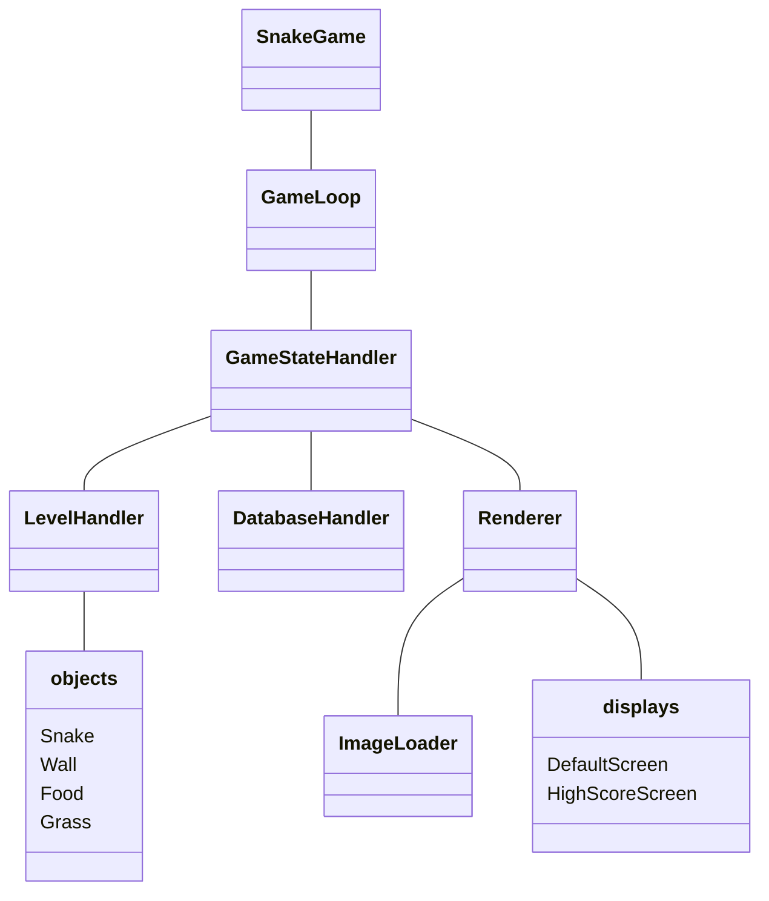
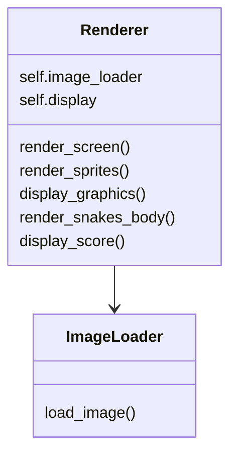
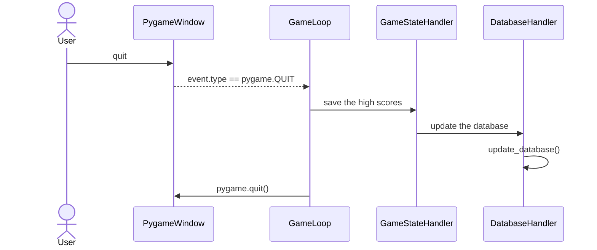
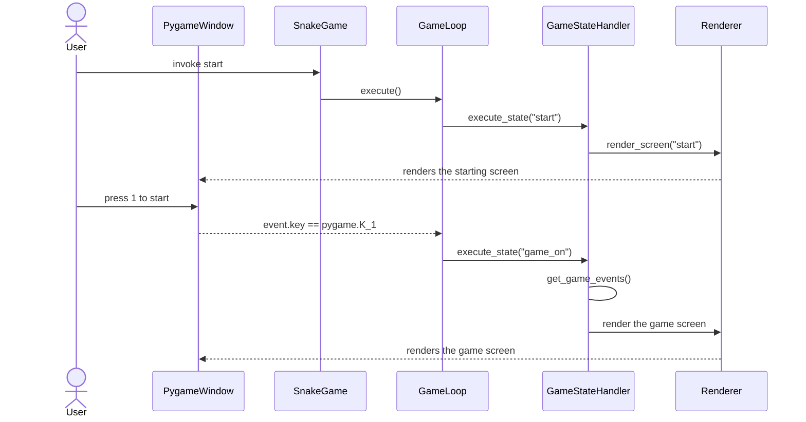
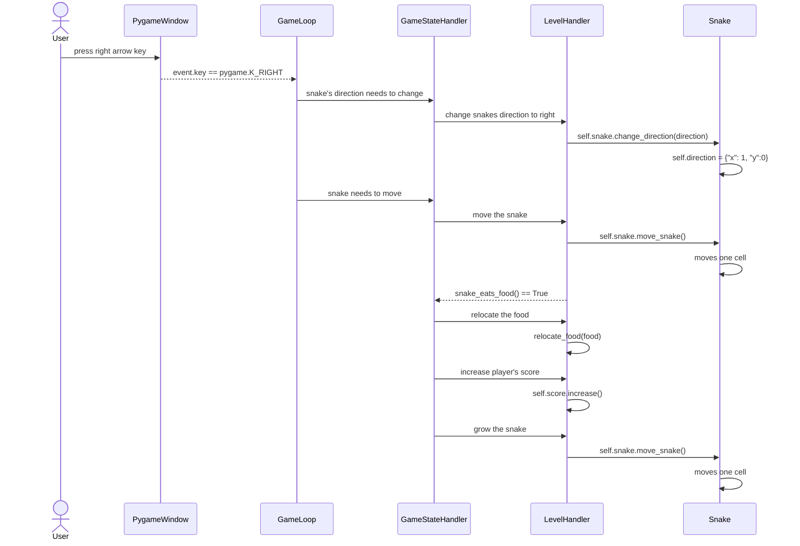

# Arkkitehtuurikuvaus 

## Rakenne
Ohjelman olennaisimpien komponenttien luokka/pakkauskaavio on seuraavanlainen:

Ohjelman konfiguroinnin ja käynnistämisen hoitaa luokka `SnakeGame`. `Loop` pyörittää pelisilmukkaa ja reagoi käyttäjän painaessa näppäimiä. `GameStateHandler` vastaa pelin eri tilojen hallinnasta, `LevelHandler` pelattavan tason generoinnista ja hallinnasta, ja `Database` kommunikoi SQLite-tietokannan kanssa. Grafiikat renderöi `Renderer`. Hakemistossa `objects` on luokat, joilla luodaan pelialueelta löytyviä olioita. `Displays`-hakemistossa on pohjat pelin eri näkymille.

## Käyttöliittymä

Käyttöliittymästä vastaa luokka `Renderer`, joka käyttää apunaan luokkaa `ImageLoader`. `ImageLoader` hakee kuvia `images`-hakemistosta ja palauttaa ne `Renderer`-luokan käytettäväksi. `Renderer`-luokan hieman tiivistetty luokkakaavio näyttää tältä:

`GameStateHandler` antaa `Renderer`-oliolle komentoja, joiden perusteella se renderöi eri näkymät ja grafiikat. Pelissä on kuusi eri näkymää:

- Aloitus
- Peli
- Tauko
- Häviö
- Voitto
- Tulokset

Edellä mainituista jokainen voittonäkymää lukuun ottamatta käyttää samaa `displays/default.py`-tiedostosta löytyvää pohjaa. Voittonäkymän pohja taas löytyy tiedostosta `displays/scores.py`.

## Sovelluslogiikka

Ohjelman sovelluslogiikan kattava koodi löytyy pääosin luokista `Loop`, `GameStateHandler` ja `LevelHandler`. ´Loop´ sisältää itse pelisilmukan. Pelisilmukan kierroksen aikana tapahtuu seuraavat asiat:

Kierroksen alussa `GameStateHandler` saa käskyn suorittaa jokin pelitila. Jos käyttäjä laittaa pelin tauolle painamalla p-näppäintä, annetaan komento `self._game_state_handler.execute_state('pause')`. Tämän jälkeen silmukassa tarkistetaan komennolla `self._game_state_handler.change_state()`, onko `GameStateHandler` havainnut tarpeen vaihtaa pelitilaa. Tarpeen löytyessä `GameStateHandler`-oliolle annetaan käsky nollata pelitila,
jotta seuraavalla kierroksella uusi pelitila voidaan suorittaa ongelmitta. Viimeiseksi tarkistetaan komennolla `self.keys_pressed()` onko käyttäjä painanut jotakin näppäintä ja suoritetaan siihen liittyvät toimenpiteet.

`GameStateHandler` ja `LevelHandler` kommunikoivat pelin kulkuun liittyvistä asioista. `LevelHandler`-luokan tehtävä on suorittaa pelialueeseen liittyviä toimenpiteitä. Sen työkaluihin kuuluvat muun muassa pelialueen Spritejen generoiminen, pelaajan pisteiden muokkaaminen ja käärmeen ohjaaminen. `GameStateHandler` puolestaan antaa `LevelHandler`-oliolle komentoja, joiden perusteella edellä mainittuja asioita tehdään.

## Tiedon tallentaminen

Ohjelma käyttää pelaajan pisteiden tallentamiseen SQLite-tietokantaa. Kun ohjelma käynnistyy, `Loop` tekee funktiokutsun `self._game_state_handler.get_high_scores()`
jolloin `GameStateHandler` hakee tietokantaan tallennetut tulokset ja kopioi ne itselleen listaan ohjelman suorituksen ajaksi. Ohjelman sulkeutumisen yhteydessä
Loop tekee funktiokutsun `self._game_state_handler.save_high_scores_to_database()` jonka seurauksena `GameStateHandler` tallentaa DatabaseHandlerin kautta hallussaan olevat tulokset tietokantatiedostoon `database.db`.
Tietokannassa on aina korkeintaan kymmenen tulosta tallennettuna.

Esitetään tiedon tallentaminen sekvenssikaaviona

## Toiminnallisuudet

Ohjelman tärkeimpiä toiminnallisuuksia ovat muun muassa uuden pelin aloittaminen, pelin laittaminen tauolle, käärmeen ohjaaminen pelialueella ja omien pisteiden tallentaminen.
Kuvataan toiminnallisuuksista kaksi sekvenssikaavioina. Ohjelma toimii seuraavalla tavalla, kun käyttäjä aloittaa uuden pelin:

Aluksi käyttäjä syöttää konsoliin komennon `invoke start`. Tällöin luokassa `SnakeGame` konfiguroidaan pelin komponentit ja käynnistetään pelisilmukka komennolla `execute()`.
`Loop` antaa `GameStateHandler`-oliolle käskyn suorittaa pelitila "start". Seuraavaksi `Renderer` renderöi aloitusnäytön Pygame-ikkunaan. Käyttäjä painaa näppäintä 1, jolloin silmukasta annetaan `GameStateHandler`-oliolle
komento `execute_state("game_on")`. `GameStateHandler` pyytää pelin tapahtumia `LevelHandler`-oliolta komennolla `get_game_events()` ja käskee `Renderer`-oliota renderöimään pelialueen.
Seuraava sekvenssikaavio kuvaa tilannetta, jossa pelaaja muuttaa käärmeen suuntaa ja ohjaa sen kirsikan luokse:

Tässä tilanteessa pelaaja painaa ensiksi oikeaa nuolinäppäintä. Tämän jälkeen silmukasta annetaan `GameStateHandler`-oliolle komento `self._game_state_handler.snake_direction_change('right')`. `GameStateHandler` delegoi käskyn `LevelHandler`-oliolle, joka taas muuttaa käärmeen suunnan. Seuraavaksi pelisilmukka ilmoittaa `GameStateHandler`-oliolle, että on aika liikuttaa käärmettä. `GameStateHandler` antaa `LevelHandler`-oliolle tästä komennon ja `LevelHandler` siirtää käärmettä yhden askeleen eteenpäin. Sitten `Levelhandler` havaitsee, että käärme on osunut kirsikkaan. Tämän seurauksena `GameStateHandler` käskee `LevelHandler`-oliota siirtämään kirsikan toiseen paikkaan, kasvattamaan käärmettä ja lisäämään käyttäjälle yhden pisteen.

