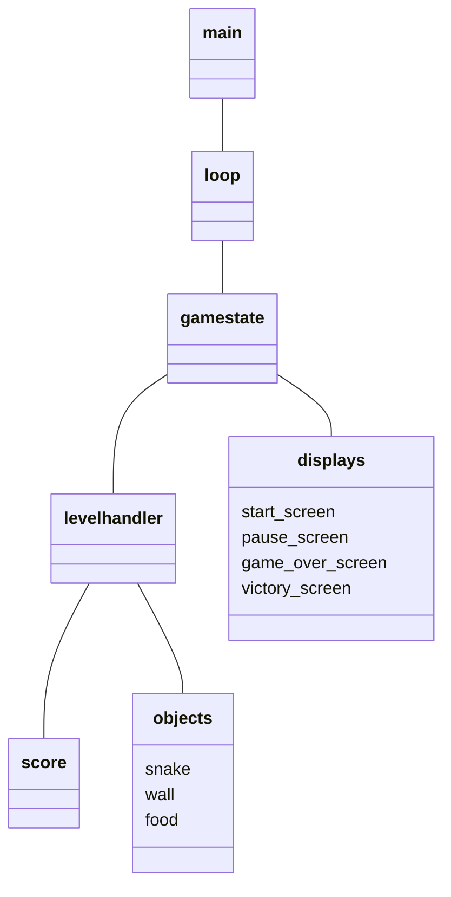
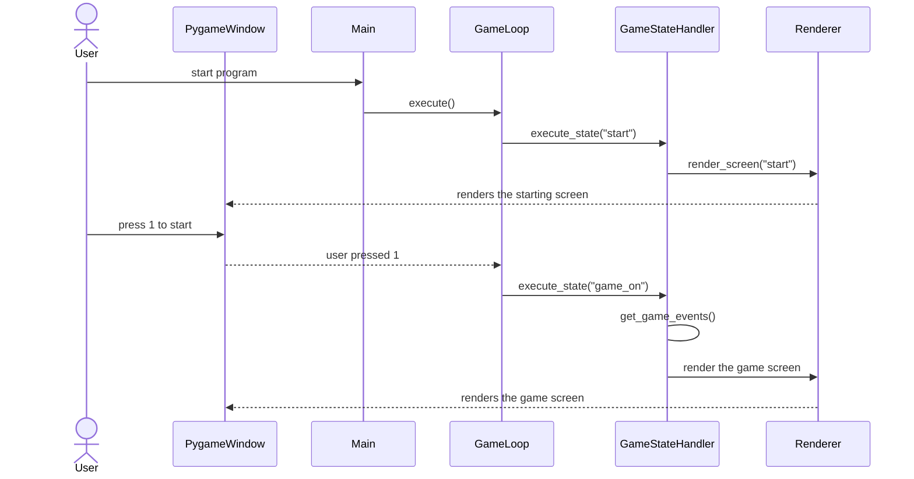

```mermaid
 classDiagram
    main -- loop
    loop -- gamestate
    gamestate -- levelhandler
    gamestate -- displays
    levelhandler -- score
    levelhandler -- objects

  class displays {
    start_screen
    pause_screen
    game_over_screen
    victory_screen
}

  class objects {
    snake
    wall
    food
}
```

Ohjelma toimii suurin piirtein seuraavalla tavalla, kun käyttäjä aloittaa uuden pelin:

```mermaid
sequenceDiagram
  actor User
  participant PygameWindow
  participant Main
  participant GameLoop
  participant GameStateHandler
  participant Renderer
  User->>Main: start program
  Main->>GameLoop: execute()
  GameLoop->>GameStateHandler: execute_state("start")
  GameStateHandler->>Renderer: render_screen("start")
  Renderer-->>PygameWindow: renders the starting screen
  User->>PygameWindow: press 1 to start
  PygameWindow-->>GameLoop: user pressed 1
  GameLoop->>GameStateHandler: execute_state("game_on")
  GameStateHandler->GameStateHandler: get_game_events()
  GameStateHandler->>Renderer: render the game screen
  Renderer-->>PygameWindow: renders the game screen
```
