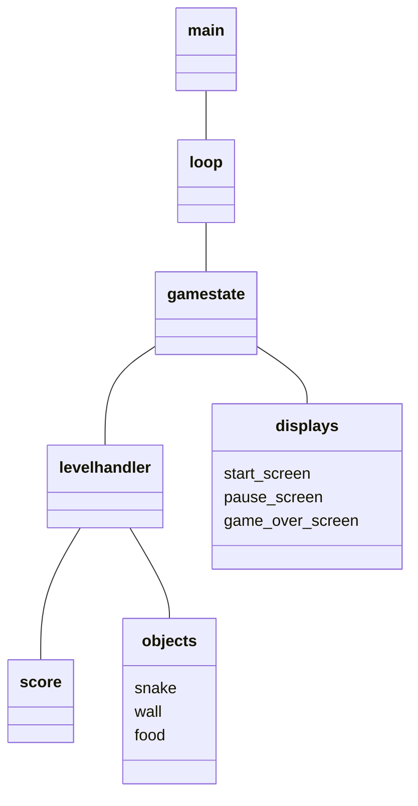

```mermaid
 classDiagram
    main -- loop
    loop -- gamestate
    gamestate -- levelhandler
    gamestate -- displays
    levelhandler -- score
    levelhandler -- objects

  class displays {
    start_screen
    pause_screen
    game_over_screen
}

  class objects {
    snake
    wall
    food
}
```
