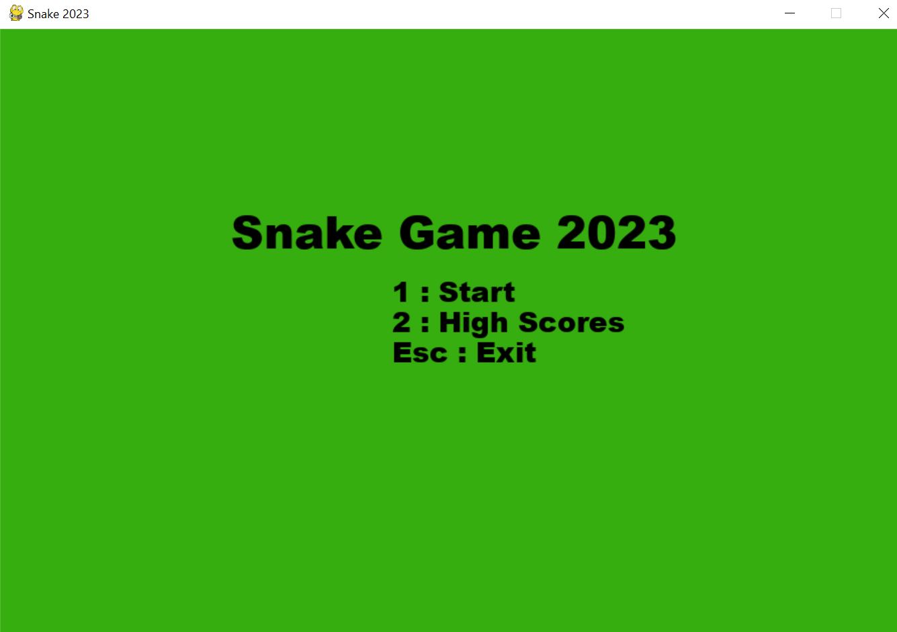
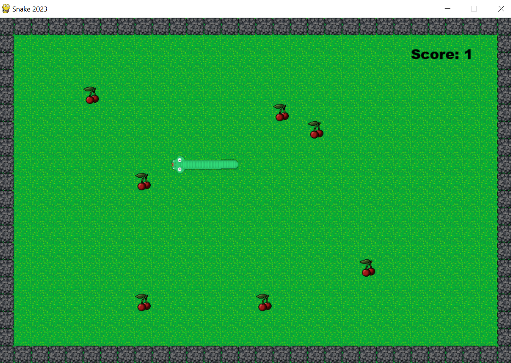
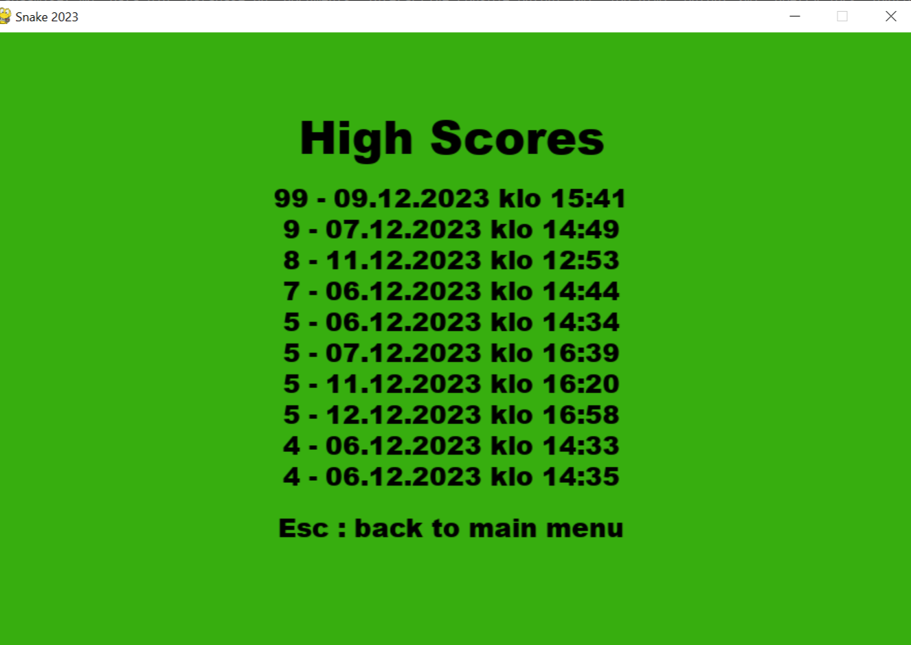

# Käyttöohje

## Ohjelman asentaminen

1. Lataa projektin uusin [release](https://github.com/valttteri/ot-harjoitustyo/releases)

2. Navigoi `snakegame`-hakemistoon ja asenna ohjelman riippuvuudet
```bash
cd snakegame
poetry install
```

## Ohjelman käynnistäminen

1. Käynnistä virtuaaliympäristö `snakegame`-hakemistosta
```bash
poetry shell
```

2. Käynnistä ohjelma
```bash
invoke start
```

## Pelaaminen

Ohjelman käynnistyessä näytölle avautuu aloitusnäkymä.



Kun aloittaa uuden pelin, avautuu pelinäkymä



Pelin aikana matoa voi ohjata nuolinäppäimillä. Pelin saa tauolle p-näppäimellä ja ohjelma sulkeutuu Esc-näppäimellä.
Peli päättyy häviöön, jos mato törmää omaan ruumiiseensa tai seinään. Voitto saavutetaan keräämällä sata kirsikkaa.
Kun peli päättyy, pelaaja voi halutessaan tallentaa saamansa pisteet. Tallennettuja pisteitä voi tarkastella huipputulokset-sivulla.


