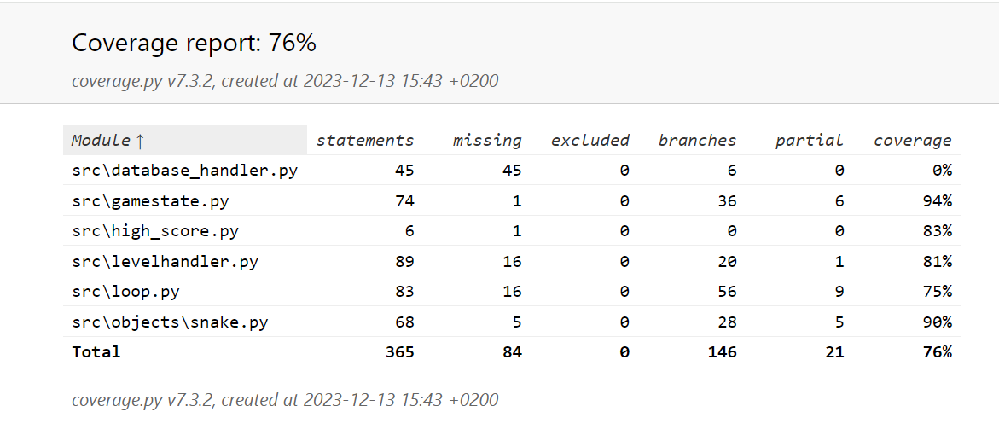

# Testausdokumentti

## Yksikkö- ja integraatiotestaus

Tiedostosta `loop.py` löytyvä pelisilmukan koodi suoritetaan testiluokalla `TestLoop`. Testeissä käytetään `Mock`-oliota, joka totetuttaa `Loop`-oliolle riippuvuutena annettavan `GameStateHandler`-olion. 
Sen lisäksi käytössä on kuusi eri stub-luokkaa. Testit käsittelevät suurelta osin tapahtumia jotka syntyvät käyttäjän painaessa eri näppäimiä ohjelman suorituksen aikana.

Testiluokka `TestSnake` vastaa `Snake`-luokan testaamisesta. Testit liittyvät puhtaasti `Snake`-olion käyttäytymiseen, eikä testiluokka käytä `Mock`-olioita tai stubeja. Testeissä varmistetaan, että 
käärmeen liikkuminen, kasvaminen ja sijoittuminen pelikentällä toimivat halutulla tavalla.

`GameStateHandler`-luokan testit suorittaa testiluokka `TestGameState`. Testit tarkastavat, että `GameStateHandlerin` jakamat komennot menevät perille halutulla tavalla. `TestGameState` käyttää
kolmea eri stubia testien suorituksen aikana.

`LevelHandler`-luokan testit suorittaa testiluokka `TestLevelHandler`. Testeissä käytetään yhtä stubia joka on `StubImageLoader`. Testiluokka varmistaa, että `LevelHandler` kommunikoi pelikentän kanssa 
niin kuin sen pitäisi.

## Testikattavuus

Tiedostoa `database_handler.py` ei ole testattu ollenkaan. Sen lisäksi testaamatta ovat jääneet `levelhandler.py`-tiedoston `relocate_food()`-funktio
sekä `loop.py`-tiedoston `keys_pressed()`-funktio. Ohjelmakoodin testien haaraumakattavuus on 76%. 

## Puutteita

Tiedostolle `database_handler.py` ei ole testejä, vaikka sen koodi liittyy sovelluslogiikkaan.

