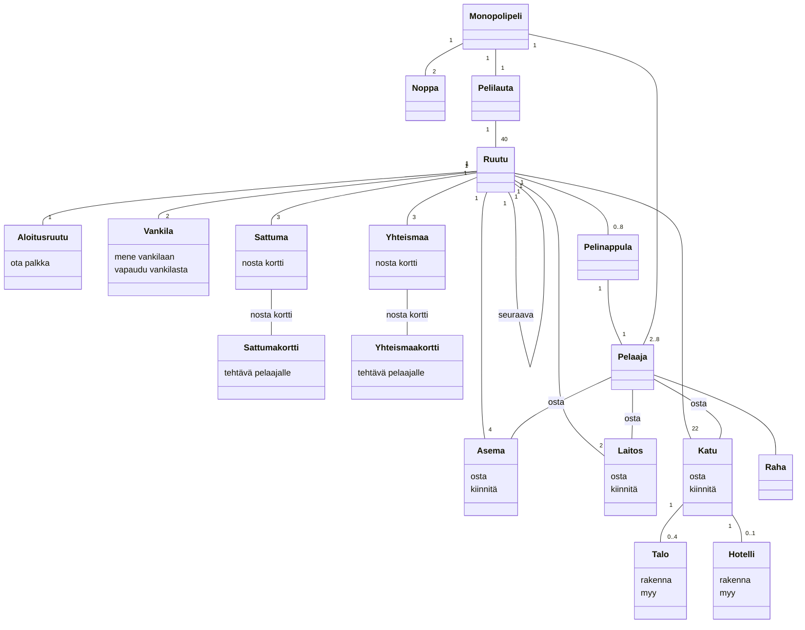

```mermaid
 classDiagram
    Monopolipeli "1" -- "2" Noppa
    Monopolipeli "1" -- "1" Pelilauta
    Pelilauta "1" -- "40" Ruutu
    Ruutu "1" -- "1" Ruutu : seuraava
    Ruutu "1" -- "1" Aloitusruutu
    Ruutu "1" -- "2" Vankila
    Ruutu "1" -- "3" Sattuma
    Sattuma -- Sattumakortti : nosta kortti
    Yhteismaa -- Yhteismaakortti : nosta kortti
    Ruutu "1" -- "3" Yhteismaa
    Ruutu "1" -- "4" Asema
    Ruutu "1" -- "2" Laitos
    Ruutu "1" -- "22" Katu
    Ruutu "1" -- "0..8" Pelinappula
    Pelinappula "1" -- "1" Pelaaja
    Pelaaja "2..8" -- "1" Monopolipeli
    Pelaaja -- Katu : osta
    Pelaaja -- Laitos : osta
    Pelaaja -- Asema : osta
    Pelaaja -- Raha
    Katu "1" -- "0..4" Talo
    Katu "1" -- "0..1" Hotelli

class Aloitusruutu{
    ota palkka
}
class Vankila{
    mene vankilaan
    vapaudu vankilasta
}
class Sattuma{
    nosta kortti
}
class Yhteismaa{
    nosta kortti
}
class Asema{
    osta
    kiinnitä
}
class Laitos{
    osta
    kiinnitä
}
class Katu{
    osta
    kiinnitä
}
class Sattumakortti{
    tehtävä pelaajalle
  }
class Yhteismaakortti{
    tehtävä pelaajalle
}
class Talo{
    rakenna
    myy
}
class Hotelli{
    rakenna
    myy
}
```
